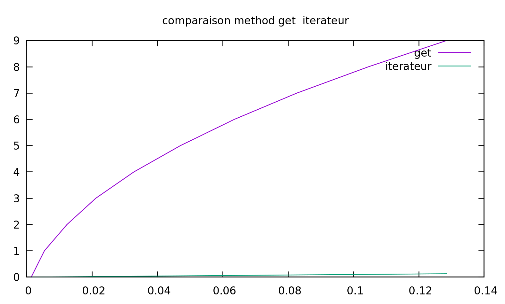

---------------
 tp-iterateurs
---------------

.. toctree::
   :maxdepth: 1

   listiterator.rst

~~~~~~~~~~~~~~~~~~~~~~
Réponses aux questions
~~~~~~~~~~~~~~~~~~~~~~

La Liste doublement chainée
----------------------------

la fonction a été implémentée en calquant celle deja présente :

`voir le code : <./_modules/listiterator.html>`_

Parcours avec des iterateurs
----------------------------

pour l'itérateur on peux coder une classe à un attribut qui pointe vers l'élément courant. 

post-scriptum  : le choix de cet façon d'itérer présente l'avantage de pourvoir directement à la Cell visée par le pointeur
néanmoins l'ajout en fin de tableau nécéssite une methode à part.
en effet lorsque l'on pointe sur la dérnière case la docstring de la méthode nous contraint d'insérer avant lelement pointé 
donc nous n'avons pas la possibilité d'ajouter en fin de liste.

Pour pallier à cela je vous propose un param suplémentaire : before 
par défaut à true , qui vas gérer si l'on insère dérrière le current ( comportement par défaut )
et si on le set à False il insérera après le courant , comme ça on récupère la capacité à insérer en fin de liste

du coup vous vérez surement les effet de tout ça dans les test résultants du fichier test.

pour l'implémentation : 

`voir le code : <./_modules/listiterator.html>`_

pour les print et tests : 

`voir le code : <./_modules/test.html>`_

Insertion avec des iterateurs
-----------------------------

Tout a été traité dans le code : 

`voir le code : <./_modules/listiterator.html>`_

Iterateurs à partir de la queue.1
---------------------------------

vous pouvez voir le code dans les mêmes méthodes que précédemment :
`voir le code : <./_modules/listiterator.html>`_

Iterateurs à partir de la queue.2
---------------------------------

il faut se rendre dans le fichier de test  :

`voir le code : <./_modules/test.html>`_

Iterateurs à partir de la queue.3
---------------------------------

je me suis permi de commenter la ligne "it.previous()"
afin de retrouver le comportement attendu. ( ceci fais liens avec la 
remarque faite en "Parcours avec des iterateurs")

`voir le code : <./_modules/test.html>`_

Iterateurs à partir de la queue.4 et 5
--------------------------------------

même effet que cité précédemment , cette implantation de l'itérateur ne 
permet pas d'ajouter en fin de ligne.

Iterateurs à partir de la queue.6 et 7
--------------------------------------

le principe est de parcourir la liste jusqu'a rrencontrer un element supérieur 
ou égal à la valeur à inserer ou in de liste si tout est inférieur puis d'insérer 
après le popint d'arrêt ( au final notre implémentation qui me semblait un peu difficile 
pour finir le tp proprement le sert ici puisqu'il est rès facile de décider d'insérer avant ou après le 
pointeur)

retrouvez le code demandé dans ce fichier : 

`voir le code : <./_modules/test.html>`_

Suppression avec des itérateurs.1
---------------------------------

encore une fois notre impémentation est très adaptée à la suppression , 
en effet il nous suffit de supprimet la case sur laquelle se trouve le pointeur et de relier 
sa case prev et se case next donc on se facilite la vie.

Suppression avec des itérateurs.2
---------------------------------

la methode a été implémentée dans le fichier suivant :

`voir le code : <./_modules/test.html>`_

pour faciliter la suite en plus de la suppréssion la methode gère le décalge du pointeur.
C-à-d : 
- on supprime la case en réorganisant les lien entre son next et sa previous , on réaffecte 
la current à la case next si elle existe , à la prev sinon . 
si on supprime le dernier element qui reste dans la liste, current sera set à None.

Suppression avec des itérateurs.3
---------------------------------

la contrainte de la question 2 est demandée car si on supprime une fois le pointeur ne point plus sur rien 
donc on peut créer une erreur si entre temps on n'a pas relocalisé le pointeur.

Suppression avec des itérateurs.4
---------------------------------

avec notre methode on peut faire la suite d'instruction suivante :

1) on créer un itérateur (qui est par défaut sur list.head)
2) tant que itérateur.current != None : 
      itérateur.remove()

Suppression avec des itérateurs.5
---------------------------------     

retrouvez les tests codés : 

`voir le code : <./_modules/test.html>`_

Performance de l’accès au i-ème élément.1 et 2
----------------------------------------------- 

le programme d e get et de test sont implémentés dans le fichier suivant : 

`voir le code : <./_modules/test.html>`_

Performance de l’accès au i-ème élément.3
------------------------------------------

on peux clairement voir sur ce graph que sur-utiliser get pose un sérieux probleme 
de consomation de ressources .
en effet c'est logique parceque get() re parcours  la liste à chaque fois qu'on cherche un element 
alors que notre iterateur par sa construction "garde en memoire" sa position ce qui nous amène à ne parcourir qu'une 
seule fois la liste pour accéder une fois à chaque element.