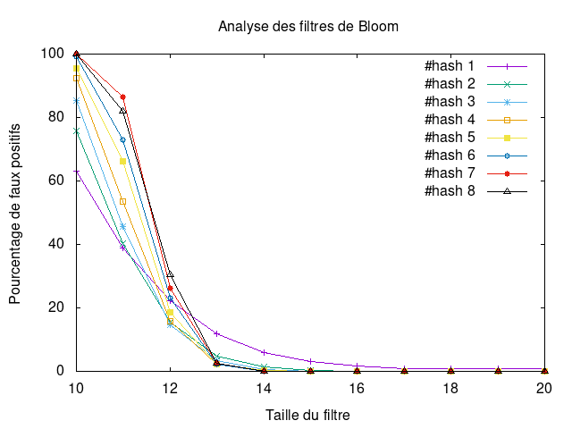

---------------
 tp-bloom
---------------

.. toctree::
   :maxdepth: 1

   hash_functions.rst
   bloomfilter.rst
   

~~~~~~~~~~
Etat du TP
~~~~~~~~~~

Décrivez ici l'état d'avancement du TP.

~~~~~~~~~~~~~~~~~~~~~~
Réponses aux questions
~~~~~~~~~~~~~~~~~~~~~~

Indiquez ici les réponses aux questions posées dans le TP. Vous
reprendrez le numéro de la section et le numéro de la question. Par
exemple pour répondre à la question 3 de la section 2.4 vous
indiquerez.

Question 4.1
------------

pour cette question elle a été traitée dans le code :

`voir le code : <./_modules/hash_functions.html>`_

Question 4.2.1
--------------

pour l'implémentation de la classe : 

`voir le code : <./_modules/bloomfilter.html>`_

Question 4.2.2
--------------

les tests se passe comme attendu , c-à-d "timoleon" se retrouve dans
les clés alros que le mot aléatoire n'y figure pas.

`voir le code : <./_modules/test.html>`_

Question 4.2.3
--------------

de façon experimentale nous avons pu voir que quand la puissance de 2 
est inférieur à 8 il est très probable que deux mots aient les mêmes clés.

Question 4.3.1
--------------

cet question à été traité dans le code suivant : 

`voir le code : <./_modules/test_faux_pos.html>`_

Question 4.3.2
--------------

l'enregistrement est disponible dans les fichiers sources

Question 4.3.3
--------------

voici les courbes de résultat : 

Question 4.3.4
--------------

en  lisant le graph on peut remarquer les chose suivantes : 

quand la taille du filtre est grande le taux  de faux positif tends vers 0 quel que 
soit le nombre de fonction de hashage. 

c'est donc que les fonction de hashage se distinguent autrement , c-à-d quand on est aux alentours du
point cirtique trouvé en 4.2.3.

ainsi ici on avais 2^10 mots dans notre liste,  comme attendu avec un taille de filtre proche de 
2^10 on a beaucoup de faux positifs.

et plus le nombre de fonction de hashage est haut plus les faux positifs sont importants. 
ce qui logique car plus on a de fonction de hashage plus on remplie le filtre ce qui implique de générer 
beauycoup de faux positifs.

En revanche on vois un changement de situation aux alentours de 2^12 de taille de filtre.
passée cette taille l'effet s'inverse et donc passé cette taille là où avoir trop de fonction de hashage 
etait un inconvénient , cela deviens un avantage. 

en conclusion : 

On peut voir qu'il est interessant en terme de perfomance (de faux positif) de determiner la nombre de fonction 
de hashage adéquat pour le volume de donée à traiter. 

il serait interessant de regarder ultérieurement le bénéfice/risque entre le gain de perfomance et le risque de 
faus positifs.