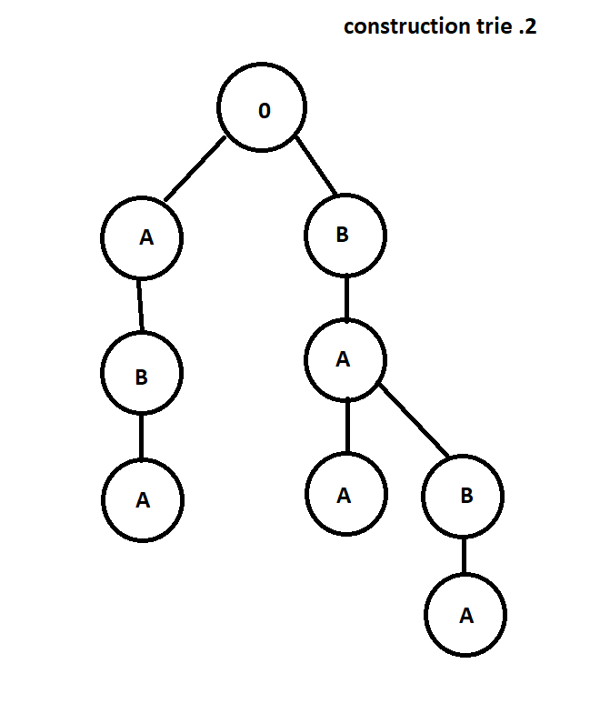

-----------------
tp-trie
-----------------

~~~~~~~~~~
Etat du TP
~~~~~~~~~~

Décrivez ici l'état d'avancement du TP.

~~~~~~~~~~~~~~~~~~~~~~
Réponses aux questions
~~~~~~~~~~~~~~~~~~~~~~

Indiquez ici les réponses aux questions posées dans le TP. Vous
reprendrez le numéro de la section et le numéro de la question. Par
exemple pour répondre à la question 3 de la section 2.4 vous
indiquerez.

Question 1.1
------------

l'idée est de contruire un type avec pour attribut ;

un bolleen qui definira si l'on se trouve sur la fin d'un mot ou non 
une hashmap qui aura opur clé les lettres et pour valeur le trie de la suite du mot

Question 1.2
------------

exemple après l'insertion des mots demandés :

Question 1.3
------------

un trie vide peut servir de marqueur de fin de mot , c-à-d que l'on peut parcourir 
les sous-tries jusqua tomber sur un trie qui a pmour attribut un trie vide. l'on sait 
alors que le trie courant est la fin d'un mot.

Cependant ce n'set pas suffisant pour detecter toute les fins de mot . En effet 
pour les mots prefixes nous avons besoin du second attribut pour alerter que nous passons sur une fin de mot.

